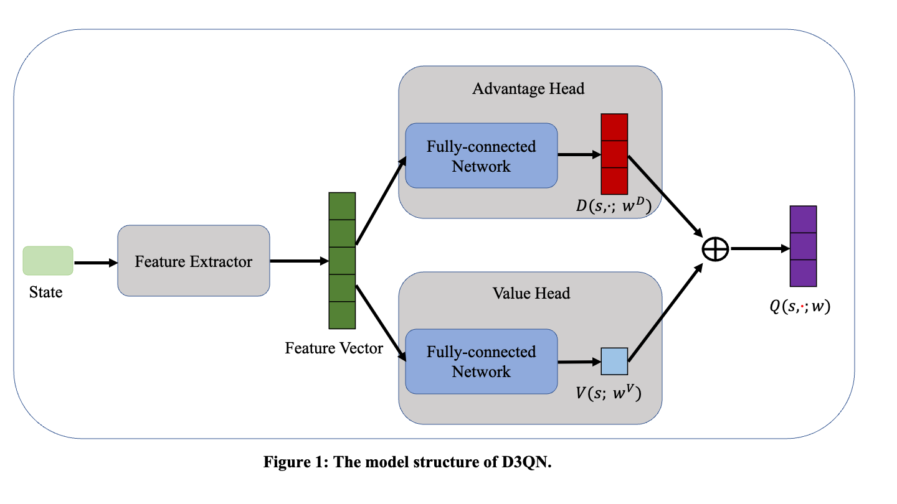

# Explanation
This markdown file describes our algorithm used and training process for **Track 1**.

<!-- Include explanation of your model here. -->
<!-- Provide a link to your source code, preferably in GitHub. -->

<!-- 
An explanation of the 
(i) online or offline,  
(ii) technique or algorithm used, 
(iii) training or development process, and 
(iv) related published or to-be-published articles/papers. 
-->

## Technique Description
We use the Reinforment Learning algorithm for **online-learning** in the Track 1 of this competition. Reinforcement learning is the training of machine learning models to make a sequence of decisions. The agent learns to achieve a goal in an uncertain, potentially complex environment. In reinforcement learning, the agent gets either rewards or penalties for the actions it performs. Its goal is to maximize the total reward. In autonomous driving tasks, the agent controls the car to drive on the road. If the agent is driving normally, it gets a positive reward, and if the agent collides or makes an unsafe decision, it gets a negative reward. 


## Model Structure
We use D3QN(Dueling Double Deep Q Network) algorithm to learn a agent in this competition. D3QN is an improvement over the DQN(Deep Q Network). D3QN algorithm combines the ideas of Double DQN and Dueling DQN algorithms to further improve the performance of the algorithm. D3QN algorithm only has a Value Network, which gets a state/observation as input, and outputs the Q-Value of every action corresponding to the input state. The model structure of dueling network is shown in the Figure 1. 



The dueling network consists of two streams that represent the value and advantage functions, while sharing a common convolutional feature learning module. In our work, the Value Network is mainly composed of three parts: Feature Extractor, Advantage Head, and Value Head. 

The Feature Extractor get a state as input, and then output the a feature vetor corresponding to the state. The structure of the Feature Extractor is shown in the Figure 2.


The input data of the Feature Extractor contains three frames of states, which are the state of the current step and the states of the previous two steps. The state of each single frame cosists of three kinds of data: rgb, goal distance and goal heading. Both goal distance and goal heading are a scalar. The rgb is a RGB image with a size of $3\times112\times112$, then we get the input rgb data with a size of $3\times 3\times112\times112$. We use **3D CNN** to extract the image feature of the three frame rgb data. The 3D CNN uses successive multiple frames as input, which increases the information of the time dimension and can extract more expressive features. The image feature vector is concatenated with the goal distance and goal heading vector, and then the concatenated vector input to a fully connected layer to output a feature vector.

The network structure of the Advantage Head and the Value Head are basically the same, and both Heads accept the same feature vector as input. The Advantage Head outputs the advantage value of each action, and the Value Head outputs the state value. Finally, the Q value is calculated from the state value and the advantage value, and the calculation formula is as follows:
$$
Q(s,·;w)=V(s;w^V)+D(s,·;w^D)-\frac{1}{|D|}\sum_{a}^{}D(s,a;w^D)
$$


## Training Protocol
We used Pytorch to conduct our experiments. We use two-stage-training strategy to learn a agent. 
- **Stage 1 (Pre-training Stage)**:
    In the first stage, we only use two scenarios, namely `3lane_cruise_single_agent` and `3lane_overtake` scenarios. We trained the agent in two scenarios sequentially, for a total of 20 epochs. And the agent explores 5,000 steps at each epoch. Finally, we save the model parameters of the agent.

- **Stage 2 (Fine-tuning Stage)**:
    In the second stage, firstly, we use the parameters of the pre-trained model to initialize the model. And we use six scenarios in this stage. In order, they are `3lane_cruise_single_agent`, `3lane_overtake`, `3lane_merge_single_agent`, `1_to_2lane_left_turn_c`, `1_to_2lane_left_turn_t`, and `3lane_cut_in`. We also trained the agent in six scenarios sequentially, for a total of 120 epochs.  

The action space is discrete. There are four actions, including: slow down, keep direction, turn left and turn right. The discount factor is set to 0.99. We learn a NN parameters with a learning rate of $10^{-3}$ at both stages. We also use epsilon-greedy strategy to encourage the agent to explore the state space. And the initial epsilon value is set to 0.1 and decreases to 0 linearly in 10,000 steps. We change the reward function: the agent gets a reward of 100 when it reached the goal, gets a reward of -50 when it collided, gets a reward of -10 when it went off road or route. The size of buffer is set to 200,000 and the batch size is 128. We randomly sample a batch of data from the buffer to train the agent every 4 steps.


## Code Description
All of our source code is shown in the train director and submision director. The training code is in `train/run.py` and the policy code is in `submision/policy.py`.
Run the following command to start to train the agent:
```shell
python run.py --logdir {Directory path for saving logs} --config {Directory path to config yaml file} 
```
Replace the contents of \{\} in the above command with the corresponding the string of the path of the file or directory.


## GitHub Link
The following GitHub link shows our source code:
https://github.com/NeoBryant/2022-NeurIPS-Driving-SMARTS-Competition

## References
[1] Chung J . Playing Atari with Deep Reinforcement Learning[J]. Computer Science, 2013.
[2] Freitas N D ,  Lanctot M ,  Hasselt H V , et al. Dueling network architectures for deep reinforcement learning[C]// International Conference on Machine Learning. JMLR.org, 2016.